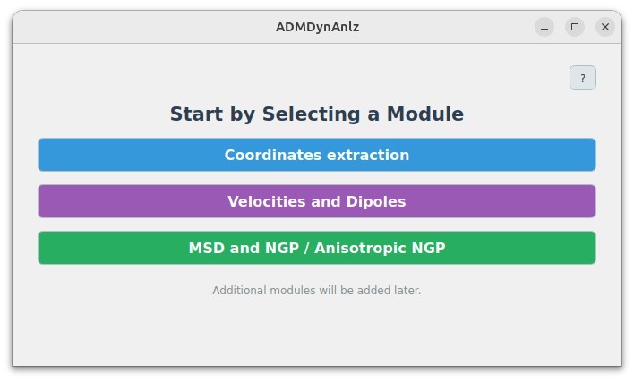
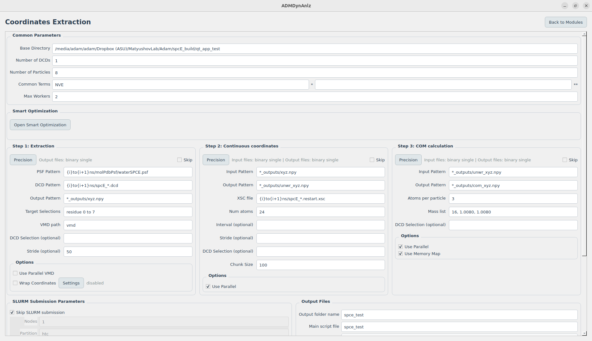
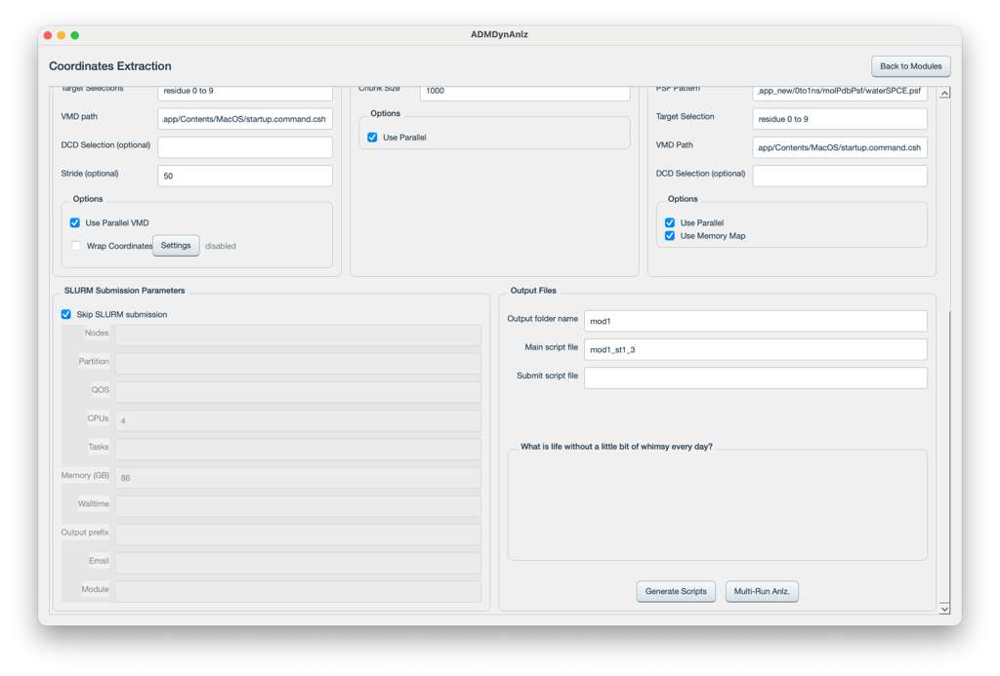
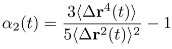
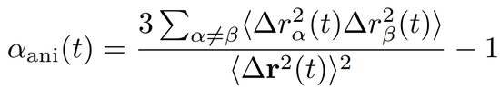
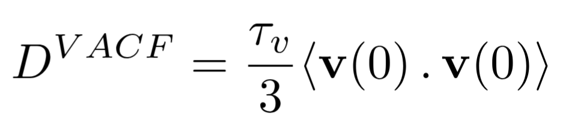
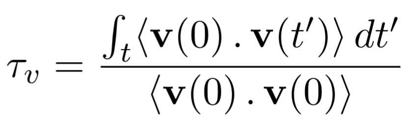
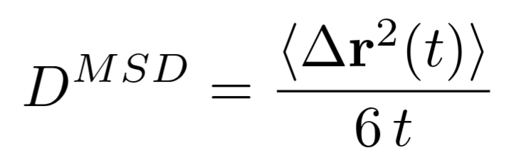
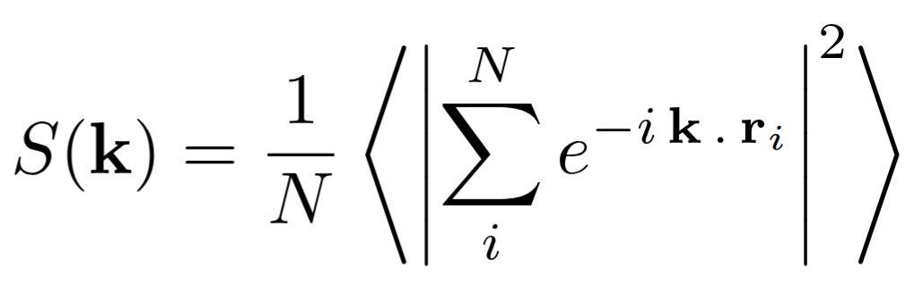

# ADMDynAnlz

 Download, setup, and launch steps. 
 Module-by-module usage guide. 
 Scientific definitions, formulas, and calculation conventions. 
 Reference information for citing the software.

ADMDynAnlz is a graphical workflow tool for post-processing molecular dynamics trajectories and generating analysis-ready workflows for transport and dynamical observables.

The current distributed application is the Qt GUI.

The application currently provides seven GUI modules:

- `Coordinates extraction`
- `Velocities and Dipoles`
- `MSD and NGP / Anisotropic NGP`
- `Correlation Functions`
- `Diffusion constant`
- `Static Structure Factor`
- `Radial Distribution Function`

Detailed section-by-section instructions are available in [Manual.md](Manual.md).
A dedicated preparation and download guide is available in [Run_Prep.md](Run_Prep.md).

## What the Software Does

ADMDynAnlz is designed to help users:

- preprocess large molecular dynamics trajectories
- organize analysis inputs through a GUI instead of manual script editing
- generate execution-ready analysis scripts
- prepare local or cluster-oriented workflows, including SLURM job files when needed

## Interface Overview

### Module selection

The launcher opens with a simple module-selection window so users can enter the workflow they need directly.

### Coordinates extraction workflow

The `Coordinates extraction` module organizes preprocessing into three stages:

1. `Extraction`
2. `Continuous coordinates`
3. `COM calculation`

It is designed to keep the full trajectory-preparation workflow in one place while still allowing individual steps to be skipped when they were already completed earlier.

This image is one example of the lower control area. The `SLURM Submission Parameters` and `Output Files` sections are available in all modules, and the optional smart optimization tool works module-by-module to recommend suitable inputs for that module's workflow and resource needs.

## Definitions

### MSD
MSD stands for **Mean Squared Displacement**. It measures the average squared displacement of particles as a function of time and is commonly used to analyze diffusion and translational dynamics.

### NGP
NGP stands for **Non-Gaussian Parameter**. It measures deviations from ideal Gaussian diffusion and helps identify non-Fickian dynamics.

### Anisotropic NGP
Anisotropic NGP quantifies directional anisotropy in molecular translational motion.

### COM
COM stands for **center of mass**.

## Modules

### 1. Coordinates extraction
This module prepares trajectory-derived data for downstream analysis. It includes three steps:

1. `Extraction`
   Extracts coordinate data from trajectory files using VMD.
2. `Continuous coordinates`
   Reconstructs continuous trajectories by removing periodic-boundary discontinuities.
3. `COM calculation`
   Computes center-of-mass trajectories for molecules or coarse-grained units.

Current Step 1 behavior highlights:

- `Selection Mode` chooses how a distance-based `Target Selection` is evaluated: `Reference-frame static set` (evaluate once on a chosen `Reference frame`, fixed atom set) or `True per-frame selection` (re-evaluate every frame, zero-padded output plus a `.counts.npy` sidecar)
- every run writes a `<output>.npy.atoms.npz` sidecar with the PSF index and resid of each coordinate slot; each generated step also writes a `mod1_stN.log` run log

Current Step 2 behavior highlights:

- `Step 2 mode` is `Continuous coordinates (MSD)` (the classic unwrap, with new large-displacement diagnostic warnings) or `Whole molecules in cell` (per-frame whole molecules wrapped back into the box, for structure/density/dipole inputs)
- `Grouping source` is `From PSF (VMD)` or `Fixed atoms per molecule (no PSF)`
- optional `Fix 1st Frame` (continuous mode) repairs molecules already split in the first frame; its integer-box shifts are applied consistently to every frame before normal unwrapping

Current COM behavior highlights:

- Step 3 uses its own `PSF Pattern`, `Target Selection`, and `VMD Path`
- `individual` mode computes one COM per resolved `Grouping Unit`
- `collective` mode ignores `Grouping Unit` and computes one COM for the whole selection
- individual COM groups do not need to have the same number of atoms

Typical outputs and units:

- extracted atomic coordinates: same length unit as the input trajectory coordinates
- continuous / unwrapped atomic coordinates: same length unit as the input trajectory coordinates
- center-of-mass coordinates: same length unit as the input trajectory coordinates

### 2. Velocities and Dipoles
This module generates workflows for:

- extracting center-of-mass velocities from velocity trajectories
- computing individual molecular dipoles
- computing collective dipole signals for selected groups

Current behavior highlights:

- velocity extraction is controlled by `Target Selection` together with `Grouping Unit`
- velocity extraction does not use a module-level particle-count field
- dipole calculations share `PSF Pattern`, `Target Selection`, `VMD Path`, `Stride`, and `Dipole Unit`
- individual dipole calculations add `Grouping Unit`, `All neutral particles`, and `COM Patterns` on top of those shared fields; `Grouping Unit = all` computes one dipole from the full selected/input coordinate set
- if `All neutral particles` is unchecked, individual dipoles use one COM vector per resolved group and frame
- stride control is available for velocity extraction and individual dipole calculations
- individual dipole magnitude output is optional
- individual dipole groups do not need to have the same number of atoms
- `Use reference point (single)` restricts any calculation mode to molecules whose probe atom is within a cutoff of a single moving reference point, runs in pure NumPy from a Module 1 coordinate file and its `.atoms.npz` sidecar (no VMD), and also writes distance vectors/scalars relative to that point

Typical outputs and units:

- COM velocities: same velocity unit as the input velocity trajectory
- individual dipole vectors: selected `Dipole Unit` (`Debye` or `e·Å`)
- individual dipole magnitudes: selected `Dipole Unit`
- collective dipole calculations can run VMD in parallel and can optionally wrap coordinates before measuring dipoles
- collective dipole vector components: selected `Dipole Unit`
- collective dipole magnitude: selected `Dipole Unit`
- reference-point (single) mode: `individual`/`custom` write padded `vec_`, `mag_`, `distancevec_`, and `distancemag_` files with a `.counts.npy` sidecar; `collective` writes a per-frame scalar to the output path and a per-frame vector to a `vec_` file

### 3. MSD and NGP / Anisotropic NGP
This module generates workflows for:

- **MSD**: Mean Squared Displacement
- **NGP**: Non-Gaussian Parameter
- **Anisotropic NGP**

`NGP α₂(t)`

  <picture>
    <source media="(prefers-color-scheme: dark)" srcset="app_images/equation_alhpa_2_dark.png">
    
  </picture>

`Anisotropic NGP`

  <picture>
    <source media="(prefers-color-scheme: dark)" srcset="app_images/equation_alhpa_ani_dark.png">
    
  </picture>

Typical outputs and units:

- MSD: squared length in the square of the coordinate unit
- NGP `α₂(t)`: dimensionless
- directional anisotropy outputs and anisotropic NGP: dimensionless

### 4. Correlation Functions
This module generates workflows for time-correlation analysis from numeric data arrays.

It supports:

- scalar-scalar correlation
- vector-vector correlation
- single-variable mode
- multiple-variable mode averaged across variables
- `Subtracting Mean` mode with mean subtraction
- `Not Subtracting Mean` mode without mean subtraction

Current behavior highlights:

- the reported correlation function is written as `C(t)/C(0)`
- the separate variance output stores `C(0) * Coefficient^2`
- `Step (between frames)` determines the unit of the horizontal axis, such as time
- `Max Workers` can calculate multiple indexed correlation functions in parallel

Typical outputs and units:

- time column: same unit implied by `Step (between frames)`
- correlation column: product of the units of the two input arrays

### 5. Diffusion constant
This module generates workflows for diffusion-constant analysis from saved VACF data, saved MSD data, or both.

It currently supports:

- a VACF-based route
- an MSD-based route
- optional infinite-size correction for both routes
- multiple temperatures in one generated script

`VACF-based diffusion constant`

  <picture>
    <source media="(prefers-color-scheme: dark)" srcset="app_images/DvACF_dark.png">
    
  </picture>

`Velocity relaxation time`

  <picture>
    <source media="(prefers-color-scheme: dark)" srcset="app_images/tau_v_dark.png">
    
  </picture>

`MSD-based diffusion constant`

  <picture>
    <source media="(prefers-color-scheme: dark)" srcset="app_images/D_MSD_dark.png">
    
  </picture>

Typical outputs and units:

- velocity relaxation time `tau`: same time unit as the saved VACF spacing input
- diffusion constant: `A^2/ps` and `cm^2/s`
- VACF variance comparison: `A^2/ps^2`

Input-handling highlights:

- relative VACF, MSD, and output paths are resolved from `Base Directory`
- if a time axis exists, the first column is treated as time and the second as data
- if a time axis does not exist, the module reconstructs time from the saved-frame timestep
- normalized VACF input disables velocity-unit conversion and uses a user-provided variance for the diffusion estimate
- if multiple temperatures match one common-term list exactly, temperatures are paired with that common term instead of nested separately

### 6. Static Structure Factor
This module generates workflows for density, charge-dipole, and charge-charge static-structure-factor analysis from saved coordinate arrays. In charge-dipole and charge-charge calculations, zero-charge sites are excluded before accumulation.

Common density inputs:

- `Base Directory`
- `Common Terms`
- `Coordinate Path`
- `Output Path`
- `k Max`, $L_x$, $L_y$, $L_z$, and `tolerance`

Charge-dipole workflows add charge values, charge coordinates, dipole positions, and dipole vectors. If the charge-values file has multiple columns, the last column is used as the charge value; zero-charge sites are excluded before cutoff neighbor searches. Charge-dipole $S_{qp}(k)$ outputs are normalized during the calculation by the number of contributing dipoles in each processed frame, then accumulated across frames and trajectory files.
Charge-charge workflows add two charge paths, one or two coordinate paths, RDF-style coordinate slicing, isotropic/directional sections, and per-mode self-pair exclusion.

The generated workflows write the requested density $S(k)$, charge-dipole $S_{qp}(k)$, or charge-charge $S_q(k)$ outputs to the user-specified output paths.
Static Structure Factor includes Smart Optimization profiles for density $S(k)$, charge-dipole $S_{qp}(k)$, and charge-charge $S_q(k)$ chunk sizes, worker counts, and SLURM resource estimates.

`Isotropic static structure factor`

  <picture>
    <source media="(prefers-color-scheme: dark)" srcset="app_images/static_structure_factor_dark.png">
    
  </picture>

Charge-dipole calculations include directional, isotropic, and optional small-k approximation modes. The full formulas and sign conventions are documented in [detailed_readme.md](detailed_readme.md).

### 7. Radial Distribution Function
This Extra module generates workflows for radial distribution functions, `g(r)`, from saved coordinate arrays such as extracted COM trajectories.

Current behavior highlights:

- `Selection 1` and `Selection 2` use zero-based particle indices
- `Selection 1` and `Selection 2` can use separate `Coordinate Path 1` and `Coordinate path 2` inputs
- coordinate inputs support Python slicing such as `[::10]`, `[100:1000:10]`, and `[100:1000:10, 50:900:5]`
- empty selections mean all particles after coordinate slicing
- `Exclude Self-Pairs` can remove self distances when selections overlap
- multiple coordinate files can be accumulated into one total RDF
- `Chunkify` exposes `Chunk Size 1` and `Chunk Size 2` for pair-distance chunking
- Smart Optimization can recommend workers, chunk sizes, and SLURM resources
- text analysis outputs use commented column headers and fixed-width aligned columns

Typical outputs:

- radial bin center `r`
- radial distribution function `g(r)` in the `_norm` RDF file
- radial number-density profile in the `_notNorm` RDF file
- running coordination number
- raw pair-count histogram `hist`

## Documentation

- Full user manual: [Manual.md](Manual.md)
- Scientific details and equations: [detailed_readme.md](detailed_readme.md)

## Citation

Per the terms described in `LICENSE.txt`, users of ADMDynAnlz should cite the software when it contributes to published or presented work.

Citation information is provided in [CITATION.md](CITATION.md).

## License

See `LICENSE.txt` for license terms.
