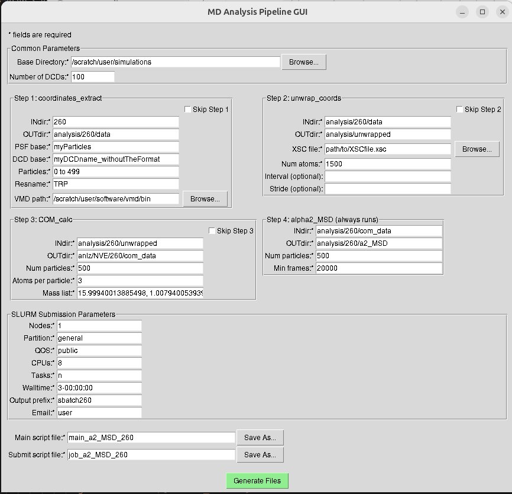

# a2\_MSD Pipeline App

A self‑contained desktop application for generating **Mean‑Square‑Displacement (MSD)** and **non‑Gaussian parameter (α₂)** analyses from NAMD DCD trajectories—plus a ready‑to‑submit SLURM job script.

| Artifact                                                | Description                                                       | Platform                           |
| ------------------------------------------------------- | ----------------------------------------------------------------- | ---------------------------------- |
| `a2_MSD_pipeline` (or `a2_MSD_pipeline.exe` on Windows) | Stand‑alone executable containing the full GUI + analysis engine. | Linux • macOS • Windows (if built) |

---

## Quick Start

```bash
# 1 – clone or download the public repo
$ git clone https://github.com/AdamPirnia/a2_MSD_pipeline.git

cd /path/to/a2_MSD_pipeline-main

# 2 – usage
    # Linux
        $ chmod +x alpha2_MSD_pip_Linux
        $ ./alpha2_MSD_pip_Linux
    # macOS 
        xattr -dr com.apple.quarantine alpha2_MSD_pip_mac_arm64  # arm CPUs
        chmod +x alpha2_MSD_pip_mac_arm64 
        $ ./alpha2_MSD_pip_mac_arm64 

        or

        xattr -dr com.apple.quarantine alpha2_MSD_pip_mac_x86_64 # Intel CPUs
        chmod +x alpha2_MSD_pip_mac_x86_64
        $ ./alpha2_MSD_pip_mac_x86_64
           

> alpha2_MSD_pip.exe      # Windows - Not provided yet
```

Or, simply double click on the executable files (after running "chmod +x alpha2_MSD_pip_..."). 
The GUI opens. Fill in the required (\*) fields, then click **Generate Files**.
Since the primary purpose of ths app requires long trajectories, it will generates two files, a SLURM submission file to be used on a remote HPC, and a main python file that uses provided functions to calculate α₂ and MSD. So building a consistent setup in terms of paths (e.g. functions) is crucial.

---

## An example



---

## What the App Does

| Step | Task                                            | Output             |
| ---- | ----------------------------------------------- | ------------------ |
|  1   | Extract raw coordinates (`coordinates_extract`) | User‑chosen OUTdir |
|  2   | Unwrap PBC (`unwrap_coords`)                    | User‑chosen OUTdir |
|  3   | Center‑of‑Mass calc (`COM_calc`)                | User‑chosen OUTdir |
|  4   | MSD & α₂ (`alpha2_MSD`)                         | User‑chosen OUTdir |

The app stitches those steps into a single driver (`<main>.py`) and a matching SLURM script (`<submit>.sh`).

---

## Typical Workflow

1. **Common**   – Base directory & number of DCDs.
2. **SLURM**    – Partition, wall‑time, CPUs, email.
3. **Generate** – Two files appear where you specified.  Submit with `<run>.sh`.

The GUI remembers your last inputs in `~/.pipeline_gui_config.json`.

---

## Requirements on the Cluster

Nothing to install—Python 3 and the standard library are bundled into the executable.

---

## Considerations

1. **VMD** – You should have VMD installed prior to running the pipeline, as it’s required for Step 1.
2. **Step 1** – Use a TCL-compatible syntax to fill the fields that VMD will consume. For example:
   - ``Particles: `0 to 120` ``  ← comes after `residue` in the VMD command  
   - ``Resname:   `TIP3` ``      ← comes after `resname` in the VMD command  
3. **Interval** – Use Python’s `slice` to select a subset of your trajectory. For example:  
   - ``Interval: `slice(0, 10000)` `` selects the first 10 000 frames.
4. **Stride** – Use to pick every _n<sup>th</sup>_ frame. For example:  
   - ``Stride: `5` `` runs on frames 0, 5, 10, 15, …  


---

## FAQ

|  Q                                 |  A                                                                                     |
| ---------------------------------- | -------------------------------------------------------------------------------------- |
| *Where is the source?*             | This public repo distributes the compiled app and libraries.                           |
| *Does it work on local computers?* | Yes. In that case, simply ignore the SLURM submission file and run the main code.      |
| *Can I rebuild for another OS?*    | Clone the private source repo and run the PyInstaller build workflow on that platform. |

---

© 2025 Adam Pirnia — All rights reserved.

